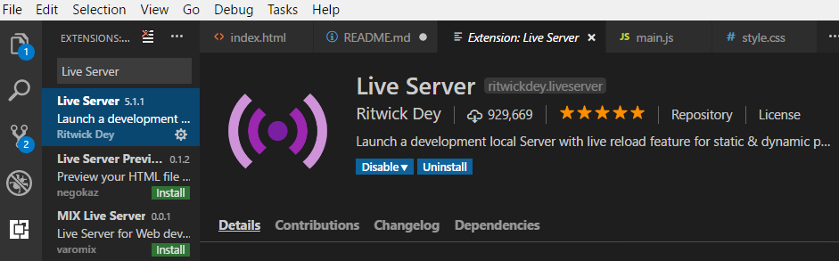
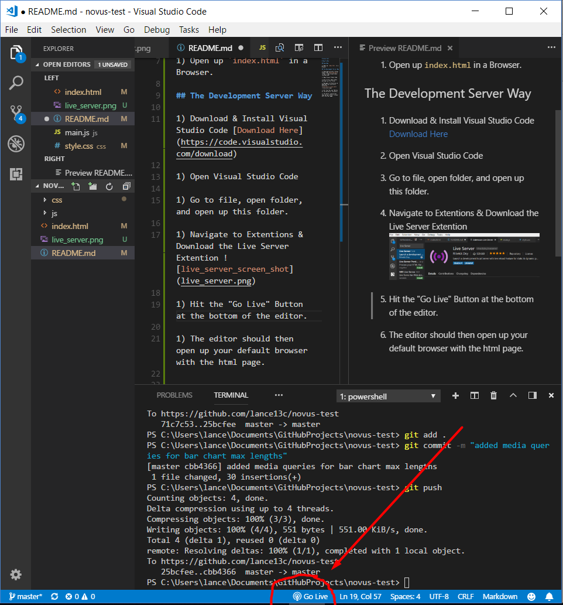

# novus-test

# How To Run

## Easy Way

1) Open up `index.html` in a Browser.

## The Development Server Way

1) Download & Install Visual Studio Code [Download Here](https://code.visualstudio.com/download)

1) Open Visual Studio Code

1) Go to file, open folder, and open up this folder.

1) Navigate to Extensions & Download the Live Server Extension 

1) Hit the "Go Live" Button at the bottom of the editor. 

1) The editor should then open up your default browser with the html page.

